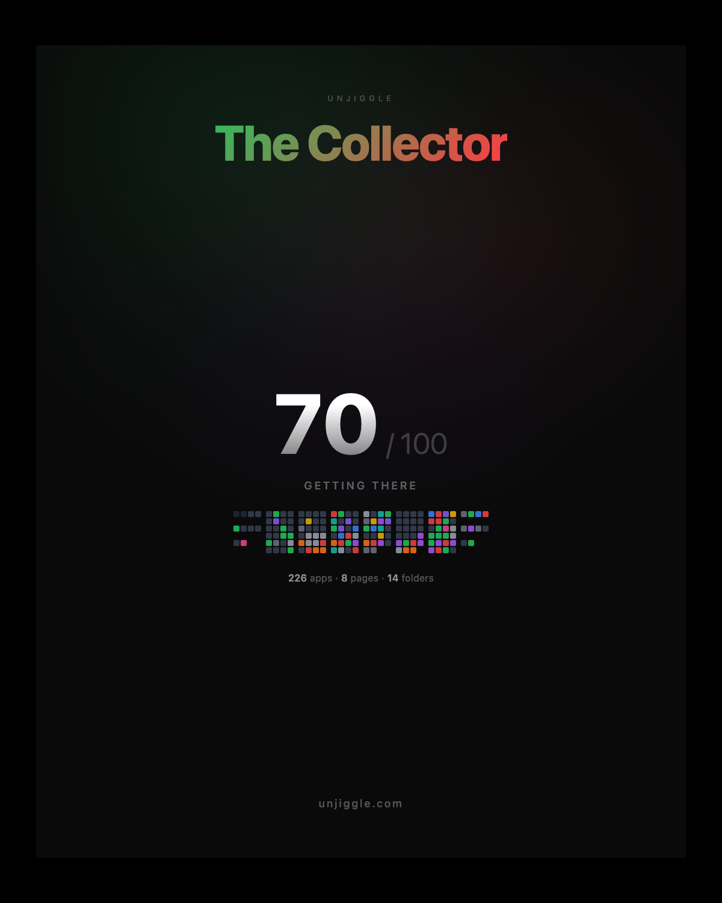

# Unjiggle

**Your iPhone home screen is a mess. You know it. You've given up fixing it. Unjiggle fixes it for you.**

Unjiggle is an AI-powered CLI that reads your iPhone home screen, scores your organization, roasts your app collection, writes obituaries for your dead apps, and generates share cards you'll actually want to post.

<p align="center">
  
</p>

## Quick Start

```bash
pip install unjiggle
```

Connect your iPhone via USB, then:

```bash
unjiggle go
```

One command. It scans your phone, scores your organization, calculates your swipe tax, and generates a share card that auto-copies to your clipboard. Cmd+V to paste into iMessage, Twitter, or Instagram.

## Share Cards

Every feature generates a 1080x1350 share card that copies to your clipboard automatically. No screenshots needed — just Cmd+V.

<p align="center">
  
</p>

## Features

### Core (no API key needed)

| Command | What it does |
|---------|-------------|
| `unjiggle go` | Full experience: scan, score, archetype, swipe tax, share card |
| `unjiggle swipetax` | How many unnecessary swipes your layout costs per year |
| `unjiggle scan` | See your layout color-coded by category |
| `unjiggle score` | Organization score (0-100) with breakdown |
| `unjiggle demo` | Try it without a phone — see what the output looks like |

### Viral features (works without API key, better with one)

| Command | What it does |
|---------|-------------|
| `unjiggle mirror` | Personality roast from your app collection |
| `unjiggle obituary` | Eulogies for your dead apps |

These generate share cards with or without an API key. With Claude or GPT, the roasts are funnier and more personal. Without, you get a solid rule-based analysis.

### AI-powered (needs API key)

| Command | What it does |
|---------|-------------|
| `unjiggle analyze` | Deep AI observations (Claude or GPT-4.1) |
| `unjiggle suggest` | Interactive walkthrough — apply changes step by step |
| `unjiggle suggest --apply-all` | Just Fix It mode — apply everything at once |

### Safety

| Command | What it does |
|---------|-------------|
| `unjiggle safety-test` | Prove read/write works (changes nothing) |
| `unjiggle backup` | Save current layout |
| `unjiggle restore` | Undo any changes |

## Requirements

- **macOS** (USB communication with iPhone)
- **iPhone connected via USB** with "Trust This Computer" accepted
- **Python 3.10+**
- **API key** (optional): set `ANTHROPIC_API_KEY` or `OPENAI_API_KEY` for AI features. Core features and share cards work without one.

## How It Works

Unjiggle uses [pymobiledevice3](https://github.com/doronz88/pymobiledevice3) to communicate with your iPhone's SpringBoard services over USB. It reads the `IconState` (your home screen layout), enriches it with App Store metadata, and generates observations and layout suggestions.

On macOS 12-15, it can also read Screen Time data from `knowledgeC.db` for real app usage stats (last opened, daily opens). On newer macOS versions, it falls back to positional heuristics.

Share cards render to PNG via Chrome headless and auto-copy to your macOS clipboard.

The write path is validated on iPhone 16 Pro, iOS 26. Every write is preceded by a verified backup and an optional round-trip safety test.

## GUI Coming Soon

A native Mac app with live preview, drag-and-drop editing, animated before/after transformations, and a slider to control aggressiveness is in development.

**Sign up for early access:** [unjiggle.com](https://unjiggle.com)

## License

GPL-3.0 (matching pymobiledevice3)
