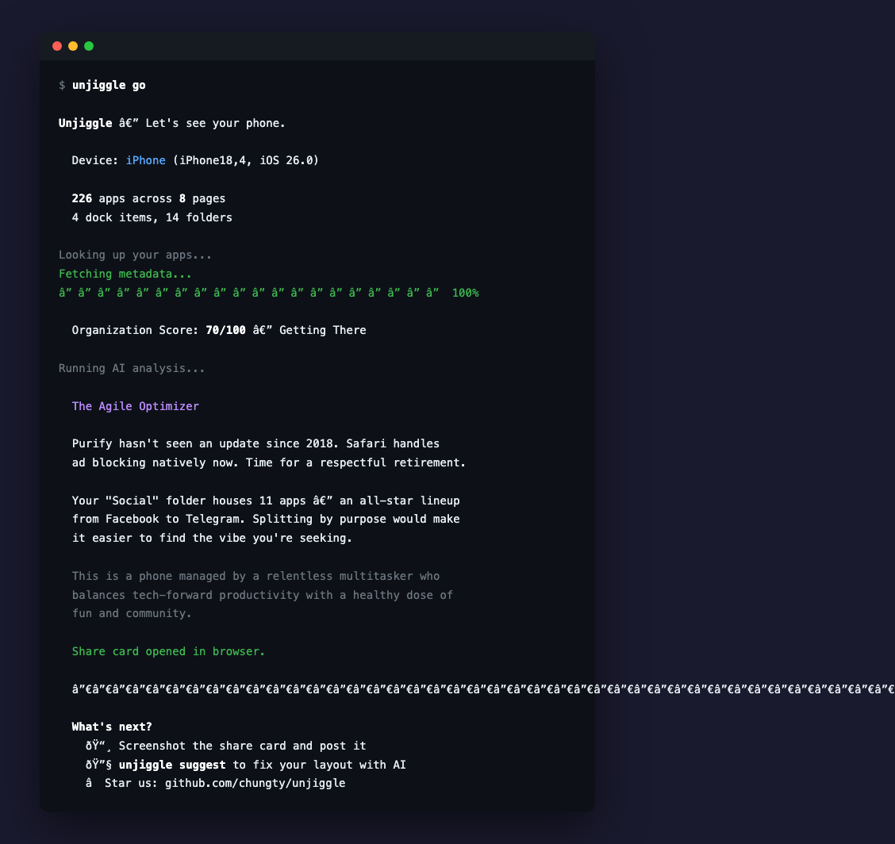

# Unjiggle

Public engine and CLI for reading, diagnosing, and safely transforming iPhone home screen layouts over USB.

This repository is the open-source core:
- device connection and layout read/write
- scoring, diagnostics, and shareable reports
- safe transforms, backups, and restore
- a machine-readable JSON API used by separate clients

It is not the private product repo. Named growth mechanics, lifecycle funnels, streaks, and branded campaign wrappers do not belong here.

Boundary details live in [ARCHITECTURE.md](ARCHITECTURE.md). Contribution rules live in [CONTRIBUTING.md](CONTRIBUTING.md).

<p align="center">
  
</p>

## Quick Start

```bash
pip install unjiggle
```

Connect your iPhone via USB, then:

```bash
unjiggle go
```

That scans your phone, scores the layout, runs diagnostics, and generates a report.

## What This Repo Owns

### Diagnostics

| Command | What it does |
|---------|-------------|
| `unjiggle go` | Full scan, score, analysis, and report |
| `unjiggle scan` | Show the current home screen layout |
| `unjiggle score` | Compute the organization score |
| `unjiggle analyze` | AI observations about the current layout |
| `unjiggle mirror` | Personality-style diagnostic from the app collection |
| `unjiggle obituary` | Dead-app graveyard analysis |
| `unjiggle swipetax` | Estimate wasted swipes per year |
| `unjiggle report` | Generate a shareable report card |
| `unjiggle demo` | Run the CLI without a phone |

### Safe transforms

| Command | What it does |
|---------|-------------|
| `unjiggle suggest` | Preview changes step by step |
| `unjiggle suggest --apply-all` | Apply the full suggested transform |
| `unjiggle backup` | Save the current layout before changes |
| `unjiggle restore` | Restore a saved backup |
| `unjiggle safety-test` | Verify the write path without changing layout |

### Machine API

`unjiggle json ...` exposes structured output for external clients. That JSON API is public and stable enough to power separate frontends, including the private native Mac app.

Useful preset endpoints:
- `unjiggle json suggest --preset focus|relax|minimal|beautiful` for one preset preview
- `unjiggle json presets` for a batch of all built-in preset previews from one shared scan

## Requirements

- macOS
- iPhone connected via USB with "Trust This Computer" accepted
- Python 3.10+
- Optional API key: set `ANTHROPIC_API_KEY` or `OPENAI_API_KEY` for AI features

## How It Works

Unjiggle uses [pymobiledevice3](https://github.com/doronz88/pymobiledevice3) to communicate with iPhone SpringBoard services over USB. It reads `IconState`, enriches the layout with App Store metadata, computes diagnostics, previews transforms, and can safely write changes back after backup.

On supported macOS versions it can also read Screen Time data from `knowledgeC.db` for usage-aware suggestions. Otherwise it falls back to positional heuristics.

Share cards render to PNG via headless Chrome and copy cleanly to the macOS clipboard.

## Public vs. Private

The public repo owns generic primitives and diagnostics:
- layout read/write
- score and analysis engines
- shareable single-snapshot diagnostics
- generic transforms such as a one-page preset
- backup, restore, and JSON contracts

The private product owns conversion mechanics and branded wrappers:
- named campaigns and challenges
- streaks, milestones, and give-up loops
- growth experiments, funnels, and product marketing strategy

If a feature blurs that line, update [ARCHITECTURE.md](ARCHITECTURE.md) before shipping it.

## Project Links

- Website: [unjiggle.com](https://unjiggle.com)
- Repository: [github.com/chungty/unjiggle](https://github.com/chungty/unjiggle)

## License

GPL-3.0-or-later
