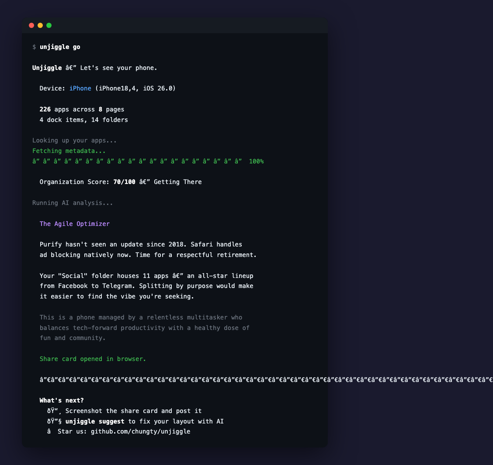

# Unjiggle

Public engine and CLI for reading, diagnosing, and safely transforming iPhone home screen layouts over USB.

This repository is the open-source core:
- device connection and layout read/write
- scoring, diagnostics, and shareable reports
- safe transforms, backups, and restore
- a machine-readable JSON API used by separate clients

It is not the private product repo. Named growth mechanics, lifecycle funnels, streaks, and branded campaign wrappers do not belong here.

Boundary details live in [ARCHITECTURE.md](ARCHITECTURE.md). Contribution rules live in [CONTRIBUTING.md](CONTRIBUTING.md).

<p align="center">
  
</p>

## Quick Start

```bash
pip install unjiggle
```

Connect your iPhone via USB, then:

```bash
unjiggle go
```

That scans your phone, scores the layout, runs diagnostics, and generates a report.

## What This Repo Owns

### Diagnostics

| Command | What it does |
|---------|-------------|
| `unjiggle go` | Full scan, score, analysis, and report |
| `unjiggle scan` | Show the current home screen layout |
| `unjiggle score` | Compute the organization score |
| `unjiggle analyze` | AI observations about the current layout |
| `unjiggle mirror` | Personality-style diagnostic from the app collection |
| `unjiggle obituary` | Dead-app graveyard analysis |
| `unjiggle swipetax` | Estimate wasted swipes per year |
| `unjiggle report` | Generate a shareable report card |
| `unjiggle demo` | Run the CLI without a phone |

### Safe transforms

| Command | What it does |
|---------|-------------|
| `unjiggle suggest` | Preview changes step by step |
| `unjiggle suggest --apply-all` | Apply the full suggested transform |
| `unjiggle backup` | Save the current layout before changes |
| `unjiggle restore` | Restore a saved backup |
| `unjiggle safety-test` | Verify the write path without changing layout |

### Machine API

`unjiggle json ...` exposes structured output for external clients. That JSON API is public and stable enough to power separate frontends, including the private native Mac app.

Useful preset endpoints:
- `unjiggle json suggest --preset focus|relax|minimal|beautiful` for one preset preview
- `unjiggle json presets` for a batch of all built-in preset previews from one shared scan

In a transform preview, each entry of `changes` has `from_page` and `to_page` counted from 1, as the owner counts pages. A `delete` change also has `gratitude` and a `detail` line: a delete takes the icon off the home screen, and the app stays installed. The preview of `unjiggle json suggest --intent` also has `plan_warnings`: what the AI Stylist's plan asked for that the preview does not do, such as apps that did not fit on page 1. Each warning has a `kind`, a `message` and the `bundle_ids` that it is about.

`unjiggle.cli.JSON_CONTRACT` is the version of this contract (now 2). A client that bundles the engine can require a minimum version. Every `unjiggle json` command asks no question and writes exactly one JSON document to stdout. All other text goes to stderr. On failure, the document is `{"error": "..."}`, the message also goes to stderr, and the exit code is 1.

`unjiggle json apply` reads `{"operations": [...], "snapshot_id": "..."}` from stdin and applies all operations together, as the preview of `json suggest` shows them. `snapshot_id` is optional. Send the `snapshot_id` of the preview (from `json suggest` or `json presets`): when the layout on the phone changed after the preview, apply writes nothing and returns an error that starts with `Not written:`. Before it writes, it checks the new icon state: when that state would differ from the preview, would remove an icon that no operation names, or would add an app that is not on the home screen, it writes nothing and returns an error that starts with `Not written:`. Then it makes a verified backup, writes, and reads the layout back to compare it with the preview. It does not do the round trip of `unjiggle suggest` (a write of the unchanged layout before the real write). To test the write path, use `unjiggle safety-test`. In the output, `backup` is the path of the backup of the layout before the command, also when nothing changed (`"changed": false`). `unjiggle json restore <backup>` undoes the change. When the write or the read-back check fails, the error also has `backup`.

`unjiggle json restore` refuses a backup with no apps on the home screen (an empty or damaged file), because it would take every icon off the home screen. Before it writes, it makes a verified backup of the layout on the phone, and returns its path as `undo_backup`. When the write or the read-back check fails, the error also has `undo_backup`. The restore writes each date of the backup (`iconModDate`) as a date, as the phone gave it, not as the text of the JSON file. It passes when the phone reads back as the backup. It accepts values of the icon state that SpringBoard changes on a write, when the dock, the pages, the folders and the widgets are the same.

On iOS 26, iOS can add an installed app from the App Library to the home screen when it gets a new layout. The read-back check of `json apply` and `json restore` accepts such apps when they are the only difference. Each one must be the plain icon of an App Store app (not a widget, a folder, a pinned icon, a second icon or an entry of another type), loose on a page, and not on the home screen of the preview (for `json apply`) or of the backup (for `json restore`). For `json apply`, it must also not be on the home screen before the write. All other icons must be in the positions of the preview or the backup. When the phone reads back the layout that it had before the write, the write had no effect, and the check fails. The engine does not move or remove these apps. The output lists them in the optional key `ios_added`, for example `[{"bundle_id": "...", "name": "...", "page": 2}]`, with the page counted from 1, and a short message goes to stderr. The key is not there when iOS added no app. All other differences still fail the check. `unjiggle restore`, `unjiggle suggest` and the round trip of `unjiggle safety-test` use the same check and name the apps.

## Requirements

- macOS
- iPhone connected via USB with "Trust This Computer" accepted
- Python 3.10+
- Optional, for AI features: `pip install 'unjiggle[ai]'` and an API key. With `ANTHROPIC_API_KEY`, layout analysis and the AI Stylist use Claude Opus 5.5 (`claude-opus-5-5`), and the Personality Mirror and the App Obituary use Claude Sonnet 5 (`claude-sonnet-5`). With `OPENAI_API_KEY`, every AI feature uses `gpt-4.1`. `--model` overrides the default, and a `claude-*` or `gpt-*` model name also selects the provider. Claude models need structured outputs: Claude Haiku 4.5, Sonnet 4.5, Opus 4.5 or newer.

## How It Works

Unjiggle uses [pymobiledevice3](https://github.com/doronz88/pymobiledevice3) to communicate with iPhone SpringBoard services over USB. It reads `IconState`, enriches the layout with App Store metadata, computes diagnostics, previews transforms, and can safely write changes back after backup.

On supported macOS versions it can also read Screen Time data from `knowledgeC.db` for usage-aware suggestions. Otherwise it falls back to positional heuristics.

Share cards render to PNG via headless Chrome and copy cleanly to the macOS clipboard.

## Public vs. Private

The public repo owns generic primitives and diagnostics:
- layout read/write
- score and analysis engines
- shareable single-snapshot diagnostics
- generic transforms such as a one-page preset
- backup, restore, and JSON contracts

The private product owns conversion mechanics and branded wrappers:
- named campaigns and challenges
- streaks, milestones, and give-up loops
- growth experiments, funnels, and product marketing strategy

If a feature blurs that line, update [ARCHITECTURE.md](ARCHITECTURE.md) before shipping it.

## Project Links

- Website: [unjiggle.com](https://unjiggle.com)
- Repository: [github.com/chungty/unjiggle](https://github.com/chungty/unjiggle)

## License

GPL-3.0-or-later
